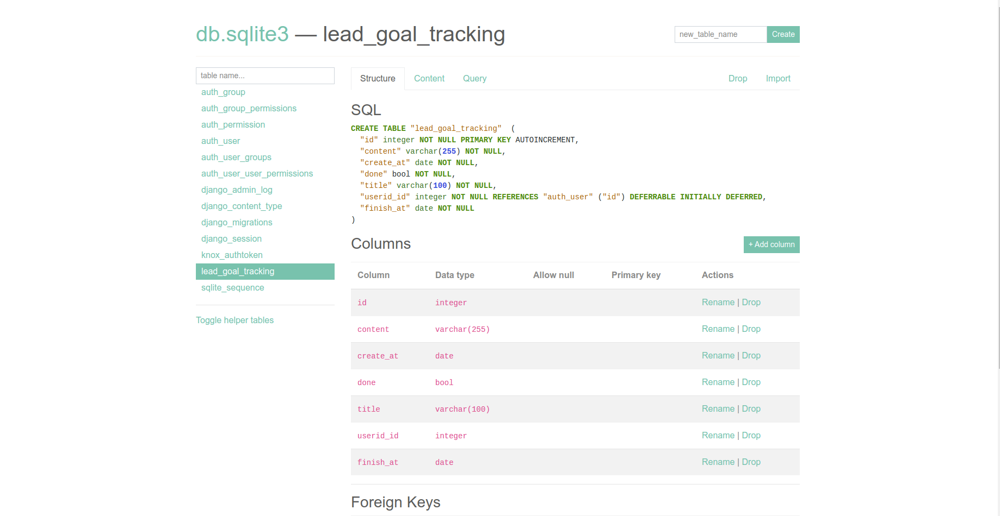
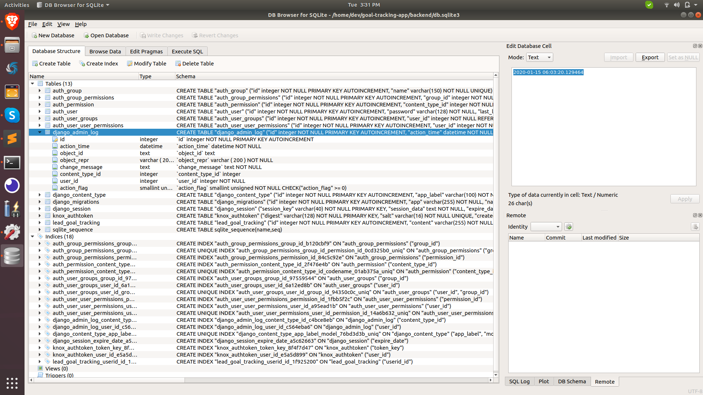

### Option 1 using sqlite-web


1. Install using `pipenv`.

```
dev@jino:~/sqlite-web$ pipenv install sqlite-web
Creating a virtualenv for this project…
Pipfile: /home/dev/sqlite-web/Pipfile
Using /usr/bin/python3 (3.6.9) to create virtualenv…
⠏ Creating virtual environment...Already using interpreter /usr/bin/python3
Using base prefix '/usr'
New python executable in /home/dev/.local/share/virtualenvs/sqlite-web-IA5u0oXi/bin/python3
Also creating executable in /home/dev/.local/share/virtualenvs/sqlite-web-IA5u0oXi/bin/python
Installing setuptools, pip, wheel...
done.

✔ Successfully created virtual environment! 
Virtualenv location: /home/dev/.local/share/virtualenvs/sqlite-web-IA5u0oXi
Creating a Pipfile for this project…
Installing sqlite-web…
Adding sqlite-web to Pipfile's [packages]…
✔ Installation Succeeded 
Pipfile.lock not found, creating…
Locking [dev-packages] dependencies…
Locking [packages] dependencies…
✔ Success! 
Updated Pipfile.lock (1daab7)!
Installing dependencies from Pipfile.lock (1daab7)…
  🐍   ▉▉▉▉▉▉▉▉▉▉▉▉▉▉▉▉▉▉▉▉▉▉▉▉▉▉▉▉▉▉▉▉ 9/9 — 00:00:14
To activate this project's virtualenv, run pipenv shell.
Alternatively, run a command inside the virtualenv with pipenv run.

```

2. Load `db.sqlite3` database in local browser.


```
(sqlite-web) dev@jino:~/sqlite-web$ sqlite_web db.sqlite3
 * Serving Flask app "sqlite_web.sqlite_web" (lazy loading)
 * Environment: production
   WARNING: This is a development server. Do not use it in a production deployment.
   Use a production WSGI server instead.
 * Debug mode: off
 * Running on http://127.0.0.1:8080/ (Press CTRL+C to quit)
```





### Option 2 using sqlitebrowser


1. Install sqlitebrowser.


```
(goal-tracking-app) dev@jino:~/goal-tracking-app/backend$ sudo apt install sqlitebrowser
```

2. Execute sqlitebrowser.


```
(goal-tracking-app) dev@jino:~/goal-tracking-app/backend$ sqlitebrowser
```





### Resources

- [sqlite-web](https://github.com/coleifer/sqlite-web)

- [sqlitebrowser](https://sqlitebrowser.org/)